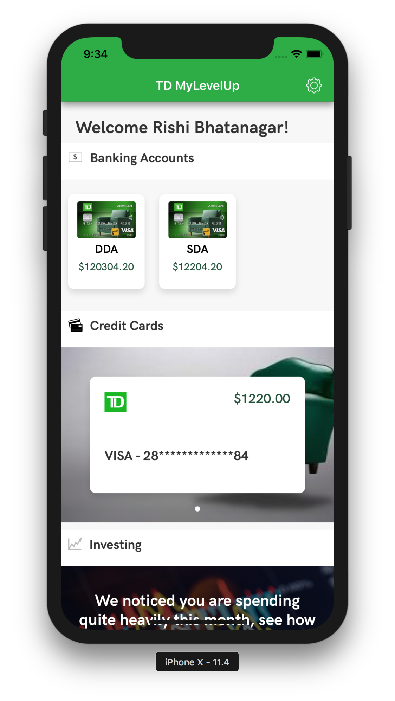
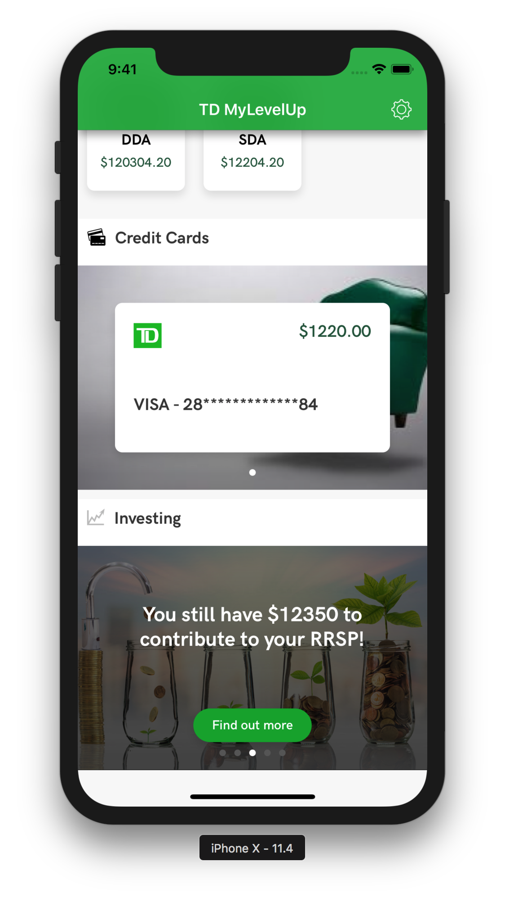
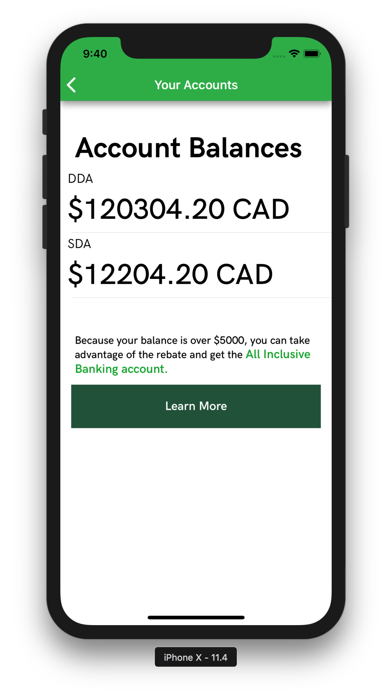
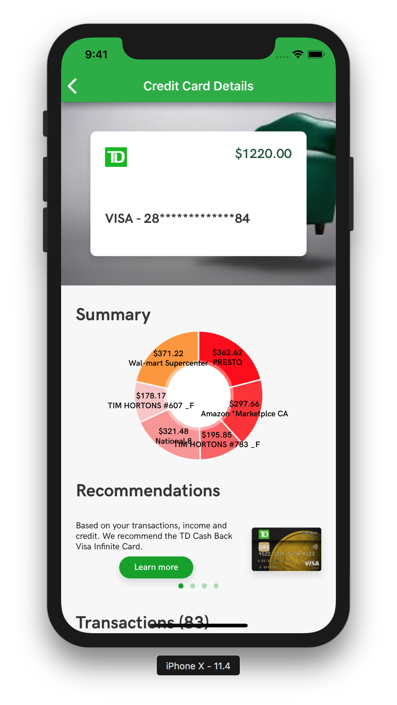
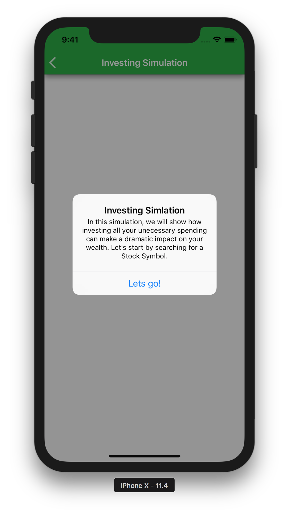
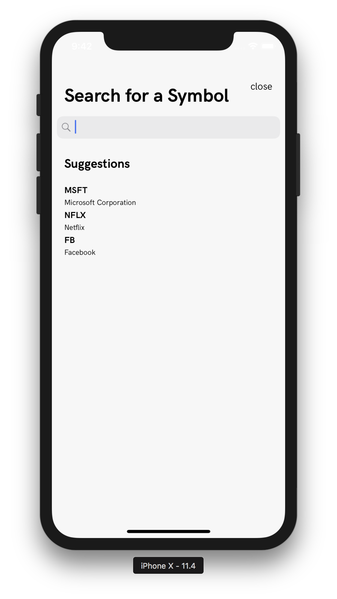
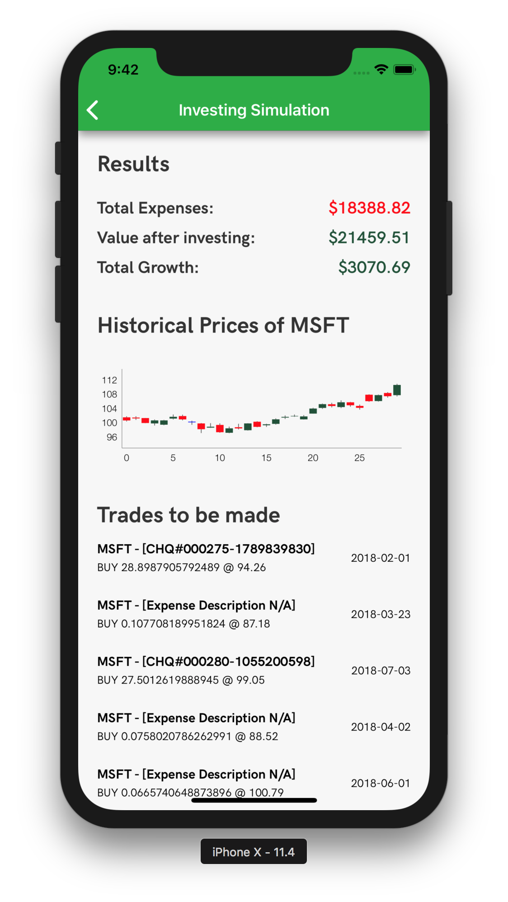

# TD MyLevelUp 
This is an iOS application filters TD products for users to work their way up to a bright financial future. 

## Problem 
One of the largest irritations for customers is landing on a product page and there is a plethora of products to choose from. 
TD has 6 different chequing accounts, 10+ different credit cards, and thousands of investing products... Where do you start? 
What product is right for you? Is this making you anxious? 

## Solution
Since we know all the user's income, transactions and financial position, we are able to help them discover the product(s) that benefit them the most without the use of forms.

## Benefits
- Ensures customers are taking advantage of all the possible TD products for them.
- Encourages users to save, invest, and grow wealth. 
- Shows customers where to start and what are the next steps.
- As a customer's financial journey progresses, product recommendations will adapt to the customer's financial position for him/her to take full advantage of.
- Educates users why they should take advantage of a particular product. (Increase financial literacy) 

## Running the Application
### Prerequisites 
1. [Xcode 9.4.1](https://developer.apple.com/xcode/download/) - Used to build the native iOS Application
1. [Cocoapods 1.5.3](https://cocoapods.org/) - Used to install dependencies 

### Getting Started

1. Clone this repository.
1. Run `pod install` to install dependencies.
1. Open Xcode and `cmd-r`!

## Screenshots
### Dashboard

### Accounts

### Credit Card

### Investing

## Resources
- [PowerPoint Presentation](presentation/MyLevelUp.pptx) - The presentation deck for TD LevelUp
- [BOTS Financial API](http://botsfinancial.com/app/login) - The API used to obtain user data
- [BOTS Financial Swagger](https://dev.botsfinancial.com/swagger-ui.html#/) - The Swagger Documentation
- [Alpha Vantage](https://www.alphavantage.co/) - Historical Stock Market Data
- [Yahoo Finance API](https://developer.yahoo.com/yql/) - Search for Investing Symbols
